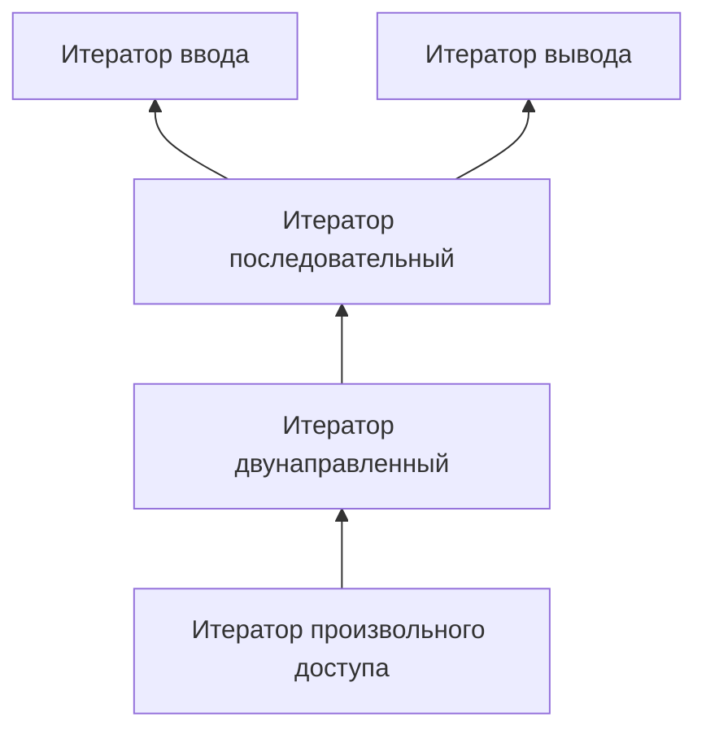

# Итераторы и Контейнеры

- [Итераторы и Контейнеры](#итераторы-и-контейнеры)
  - [Стандартная библиотека С++](#стандартная-библиотека-с)
  - [Итераторы](#итераторы)
    - [Итераторы ввода](#итераторы-ввода)
    - [Итераторы вывода](#итераторы-вывода)
    - [Последовательные итераторы](#последовательные-итераторы)
    - [Двунаправленные итераторы](#двунаправленные-итераторы)
    - [Итераторы произвольного доступа](#итераторы-произвольного-доступа)
  - [Контейнеры](#контейнеры)
    - [Последовательные контейнеры](#последовательные-контейнеры)
    - [Ассоциативные контейнеры](#ассоциативные-контейнеры)

## Стандартная библиотека С++

Стандарт языка С++ включает в себя не только описание ядра языка (описание его синтаксиса, семантики и др.), но и описание стандартной библиотеки. Основной частью стандартной библиотеки С++ является Стандартная Библиотека Шаблонов (STL - Standard Template Library).

Стандартная Библиотека Шаблонов предоставляет набор хорошо сконструированных и согласованно работающих вместе обобщённых компонентов C++. Особая забота была проявлена для обеспечения того, чтобы все шаблонные алгоритмы работали не только со структурами данных в библиотеке, но также и с встроенными структурами данных C++. Например, все алгоритмы работают с обычными указателями. Ортогональный проект библиотеки (то есть, каждая часть её является самостоятельной и независимой) позволяет программистам использовать библиотечные структуры данных со своими собственными алгоритмами, а библиотечные алгоритмы - со своими собственными структурами данных. Хорошо определённые семантические требования и требования сложности гарантируют, что компонент пользователя будет работать с библиотекой, и что он будет работать эффективно. Эта гибкость обеспечивает широкую применимость библиотеки.

Другое важное соображение - эффективность. Язык C++ успешен, потому что он объединяет выразительную мощность с эффективностью. Много усилий было потрачено, чтобы проверить, что каждый шаблонный компонент в библиотеке имеет обобщённую реализацию, которая имеет эффективность выполнения с разницей в пределах нескольких процентов от эффективности соответствующей программы ручного написания кода.

Стандартная библиотека С++ состоит из нескольких частей:

- Стандартная библиотека С
- Библиотека потоков данных
- Библиотека STL
- Некоторые дополнительные библиотеки

Заголовочные файлы стандартной библиотеки подчиняются следующим правилам: заголовочный файл пишется без расширения; библиотеки языка С начинаются с буквы с (например, вместо math.h используется `cmath`). Стандартная библиотека С++ объявлена в пространстве имён __std__.

Наибольшей частью стандартной библиотеки С++ является библиотека STL (Standard Template Library – Стандартная Библиотека Шаблонов). Библиотека STL содержит пять основных видов компонентов:

- _алгоритм (algorithm)_: определяет вычислительную процедуру.
- _контейнер (container)_: управляет набором объектов в памяти.
- _итератор (iterator)_: обеспечивает для алгоритма средство доступа к содержимому контейнера.
- _функциональный объект (function object)_: инкапсулирует функцию в объекте для использования другими компонентами.
- _адаптер (adaptor)_: адаптирует компонент для обеспечения различного интерфейса.

Данное разделение позволяет нам уменьшить количество компонентов. Например, вместо написания функции поиска элемента для каждого вида контейнера мы обеспечиваем единственную версию, которая работает с каждым из них, пока удовлетворяется основной набор требований.

## Итераторы

Понятие итераторов неразрывно связано с понятием контейнеров. __Под контейнером понимают некоторый объект, который содержит в себе группу других (обычно однотипных) объектов__. Таким образом, хорошо известные структуры данных, такие как вектор, список, стек, карта, - являются контейнерами. Для получения доступа к элементам контейнеров используются итераторы. __Итератор - объект, предоставляющий доступ к элементам контейнера и позволяющий их перебирать__. В первых реализациях стандартной библиотеки С++ итератор реализовывался как указатель на элемент контейнера.

Существуют несколько видов итераторов. Они образуют иерархию, отличаются друг от друга наличием (отсутствием) некоторых свойств:

На схеме сверху показаны связи между итераторами. Эти связи означают, например, что последовательный итератор обладает всеми свойствами итераторов ввода и вывода, поэтому он может их заменять.

> [!NOTE]
> Здесь и далее по тексту приняты следующие обозначения:
>
> - `C` - некоторый контейнер;
> - `u, a, b` - объекты класса `C`;
> - `It` - класс итератор;
> - `i`, `j` - итератор;
> - `Type` - значимый тип (тип элементов контейнера);
> - `t` - значение типа `Type`; `n` - целочисленное значение.

### Итераторы ввода

Итераторы ввода (Input iterators) позволяют получать значения объектов контейнера.

Итераторы ввода обладают следующими свойствами:

| свойство         | выражение        | примечание                                   |
| ---------------- | ---------------- | -------------------------------------------- |
| конструктор копирования | `It(j);` `It i(j);` `It i = j;` | Создаётся копия итератора. Предполагается наличие деструктора |
| оператор присваивания | `i = j`     |                                              |
| оператор сравнения | `i == j`       |                                              |
| оператор неравенства | `i != j`     |                                              |
| разыменование     | `*i`            | возвращается ссылка на элемент контейнера    |
| префиксный инкремент | `++i`        | смена итератора на сл. элемент контейнера    |
| постфиксный инкремент | `i++`       | смена итератора на сл. элемент контейнера    |

Учитывая, что итераторы ввода изменяют контейнер, не имеет смысла пользоваться одним и тем же итератором ввода дважды, потому что второй раз он может ссылаться на другой элемент контейнера.

### Итераторы вывода

Итераторы вывода (output iterators) позволяют заносить элементы в контейнер.

| свойство         | выражение        | примечание                                   |
| ---------------- | ---------------- | -------------------------------------------- |
| конструктор копирования | `It(j);` `It i(j);` `It i = j;` | Создаётся копия итератора. Предполагается наличие деструктора |
| присваивание элемента | `*i = a`    | возвращается ссылка на элемент контейнера, позволяет помещать элементы в контейнер по итератору |
| префиксный инкремент | `++i`        | смена итератора на сл. элемент контейнера    |
| постфиксный инкремент | `i++`       | смена итератора на сл. элемент контейнера    |

### Последовательные итераторы

Последовательные итераторы (Consecutive iterators) являются базовыми для большинства алгоритмов и наследуют свойства итераторов ввода и итераторов вывода. Кроме того, они имеют ряд дополнительных свойств.

| свойство         | выражение        | примечание                                   |
| ---------------- | ---------------- | -------------------------------------------- |
| конструктор по умолчанию | `It i;` `It();` | Создаётся итератор. Может создавать исключения |
| присваивание элемента | `*i = a`    | позволяет помещать элементы в контейнер по итератору |
| разыменование     | `*i`            | возвращается ссылка на элемент контейнера. Если `i == j`, то `*i == *j` |
| префиксный инкремент | `++i`        | смена итератора на сл. элемент контейнера. Если `i == j`, то `++i == ++j` |
| постфиксный инкремент | `i++`       | смена итератора на сл. элемент контейнера. Если `i == j`, то `i++ == j++` |

### Двунаправленные итераторы

Двунаправленные итераторы (bidirectional iterators) позволяют передвигаться по контейнерам как от начала к концу, так и в обратную сторону. Обладают всеми свойствами последовательных итераторов, а так же:

| свойство         | выражение        | примечание                                   |
| ---------------- | ---------------- | -------------------------------------------- |
| префиксный декремент | `--i`        | Предполагается, что существует j такой что `i == ++j`. Если `i == j`, то `--i == --j` |
| постфиксный декремент | `i--`       | Если `i == j`, то `i-- == j--` |

### Итераторы произвольного доступа

Итераторы произвольного доступа (Random access iterators) обладают свойствами двунаправленых итераторов, кроме того определены расстояние между итераторами и операция упорядочивания.

| свойство         | выражение        | примечание                                   |
| ---------------- | ---------------- | -------------------------------------------- |
| сдвиг на n элементов | `i += n`     |                                              |
|                  | `i + n` `n + i` | `i + n == n + i`                         |
| сдвиг на n элементов | `i -= n`     |                                              |
|                  | `i - n`          |                                              |
| расстояние между итераторами | `i - j` | `i == j + (i - j)`                        |
| доступ по индексу | `a[n]`          | `*(a + n)`                                   |
| упорядочивание итераторов | `i < j` | `i - j > 0`                                  |
| упорядочивание итераторов | `i > j` | `j < i`                                      |
| упорядочивание итераторов | `i <= j` | `!(j < i)`                                  |
| упорядочивание итераторов | `i >= j` | `!(i < j)`                                  |

## Контейнеры

Под контейнером понимают объект, содержащий другие (однотипные) объекты, называемые элементами контейнера. Стандартная библиотека С++ предоставляет типичные контейнеры, такие как: _список_, _вектор_, _очередь_, _карта_, _множество_ и др. Доступ к элементам контейнера осуществляется через итераторы.

К контейнерам выдвигается ряд общих требований. Это осуществляется для того, чтобы использование контейнеров было одинаковым, независимо от его реализации. Соответственно, часто контейнеры бывают взаимозаменяемы.

| свойство         | выражение        | примечание                                   |
| ---------------- | ---------------- | -------------------------------------------- |
| тип элементов контейнера | `C::value_type` |                                       |
|                  | `C::reference`   |                                              |
|                  | `C::const_reference` |                                          |
|                  | `C::pointer`     |                                              |
| итератор         | `C::iterator`    |                                              |
| константный итератор | `C::const_iterator` |                                       |
|                  | `C::difference_type` |                                          |
|                  | `C::size_type`   |                                              |
| конструктор по умолчанию | `C u;`   |                                              |
|                  | `C()`            |                                              |
| конструктор копирования | `C(a)`    |                                              |
|                  | `C u(a);`        |                                              |
|                  | `C u = a;`       |                                              |
| деструктор       | `~C()`           |                                              |
|                  | `a.begin()`      | Возвращает итератор, указывающий на первый элемент контейнера |
|                  | `a.end()`        | Возвращает итератор, указывающий за последний элемент контейнера |
| сравнение        | `a == b`         |                                              |
| неравенство      | `a != b`         |                                              |
| копирование      | `r = a`          |                                              |
|                  | `a.size()`       | Возвращает количество элементов в контейнере |
|                  | `a.max_size()`   | Возвращает максимально количество элементов в контейнере |
|                  | `a.empty()`      | `a.size() == 0`                              |
| упорядочивание   | `a < b`          |                                              |
|                  | `a > b`          |                                              |
|                  | `a <= b`         |                                              |
|                  | `a >= b`         |                                              |
|                  | `a.swap(b)`      |                                              |

### Последовательные контейнеры

Последовательные контейнеры хранят свои элементы в строго линейном порядке. К последовательным контейнерам относятся хорошо известные структуры данных __вектор__ (vector), __список__ (list), __очередь__ (deque), а также __строка символов__ (string).

Обязательные свойства последовательных итераторов:

| свойство         | выражение        | примечание                                   |
| ---------------- | ---------------- | -------------------------------------------- |
| конструктор      | `C(n, t)` | создает контейнер из n элементов равных t           |
|                  | `C a(n, t);` |                                                  |
|                  | `C(i, j)` | создает контейнер по указанному полуинтервалу итераторов |
|                  | `C a(i, j);` |                                                  |
| вставка          | `a.insert(p, t)` | вставляет элемент t перед итератором p       |
|                  | `a.insert(p, n, t)` | вставляет n элементов t перед итератором p |
|                  | `a.insert(p, i, j)` | вставляет полуинтервал `[i, j)` перед итератором p |
| удаление         | `a.erase(i)` | удаляет из контейнера элемент, на который ссылается итератор i |
|                  | `a.erase(i, j)` | удаляет полуинтервал `[i, j)` из контейнера   |

### Ассоциативные контейнеры

