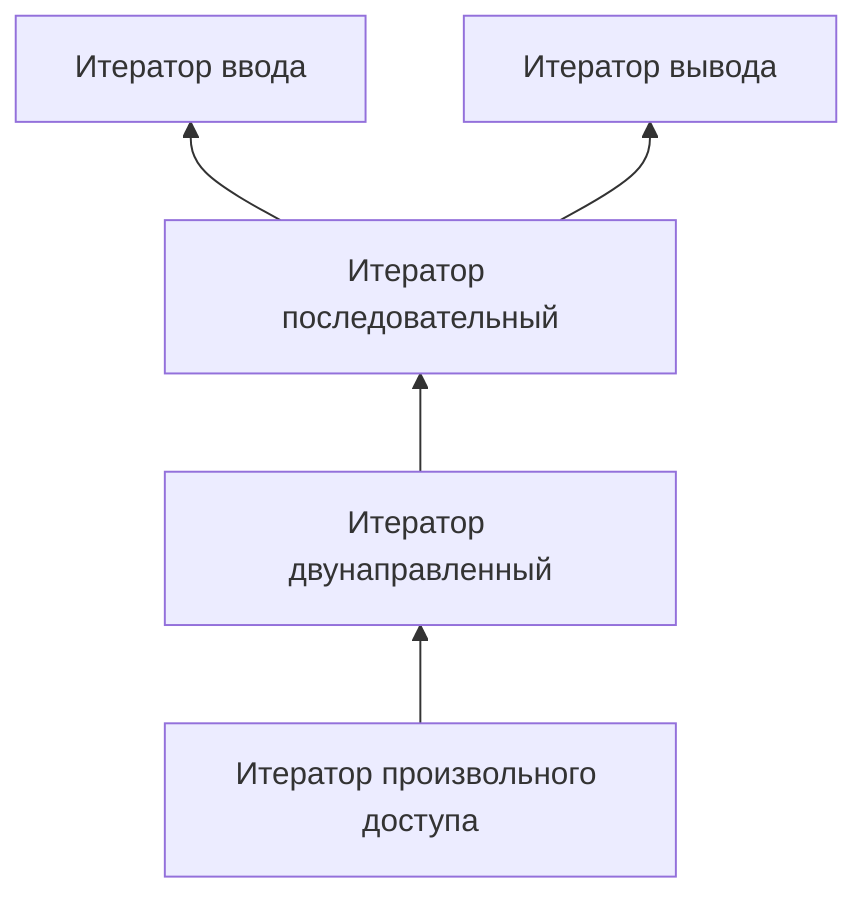

# Итераторы и Контейнеры

- [Итераторы и Контейнеры](#итераторы-и-контейнеры)
  - [Стандартная библиотека С++](#стандартная-библиотека-с)
  - [Итераторы](#итераторы)
    - [Итераторы ввода](#итераторы-ввода)
    - [Итераторы вывода](#итераторы-вывода)
    - [Последовательные итераторы](#последовательные-итераторы)
    - [Двунаправленные итераторы](#двунаправленные-итераторы)
    - [Итераторы произвольного доступа](#итераторы-произвольного-доступа)
  - [Контейнеры](#контейнеры)
  - [Последовательные контейнеры](#последовательные-контейнеры)
    - [Вектор](#вектор)
    - [Список](#список)
    - [Очередь](#очередь)
  - [Ассоциативные контейнеры](#ассоциативные-контейнеры)
    - [множество](#множество)
    - [Словарь](#словарь)
  - [Библиография](#библиография)

## Стандартная библиотека С++

Стандарт языка С++ включает в себя не только описание ядра языка (описание его синтаксиса, семантики и др.), но и описание стандартной библиотеки. Основной частью стандартной библиотеки С++ является Стандартная Библиотека Шаблонов (en. _STL - Standard Template Library_).

Стандартная Библиотека Шаблонов предоставляет набор хорошо сконструированных и согласованно работающих вместе обобщённых компонентов C++. Особая забота была проявлена для обеспечения того, чтобы все шаблонные алгоритмы работали не только со структурами данных в библиотеке, но также и с встроенными структурами данных C++. Например, все алгоритмы работают с обычными указателями. Ортогональный проект библиотеки (то есть, каждая часть её является самостоятельной и независимой) позволяет программистам использовать библиотечные структуры данных со своими собственными алгоритмами, а библиотечные алгоритмы - со своими собственными структурами данных. Хорошо определённые семантические требования и требования сложности гарантируют, что компонент пользователя будет работать с библиотекой, и что он будет работать эффективно. Эта гибкость обеспечивает широкую применимость библиотеки.

Другое важное соображение - эффективность. Язык C++ успешен, потому что он объединяет выразительную мощность с эффективностью. Много усилий было потрачено, чтобы проверить, что каждый компонент в библиотеке имеет обобщённую реализацию, которая обеспечивает эффективность выполнения в сравнении с ручной реализацией.

Стандартная библиотека С++ состоит из нескольких частей:

- стандартная библиотека С;
- поддержки языка С++;
- концепции;
- библиотека диагностики;
- управление памятью;
- потоков данных;
- библиотека STL;
- управление потоками;
- некоторые дополнительные библиотеки.

Заголовочные файлы стандартной библиотеки подчиняются следующим правилам: заголовочный файл пишется без расширения; библиотеки языка С начинаются с буквы с (например, вместо math.h используется `cmath`). Стандартная библиотека С++ объявлена в пространстве имён __std__.

Наибольшей частью стандартной библиотеки С++ является библиотека STL (Standard Template Library – Стандартная Библиотека Шаблонов). Библиотека STL содержит пять основных видов компонентов:

- _алгоритм (en. algorithm)_: определяет вычислительную процедуру.
- _контейнер (en. container)_: управляет набором объектов в памяти.
- _итератор (en. iterator)_: обеспечивает для алгоритма средство доступа к содержимому контейнера.
- _функциональный объект (en. function object)_: инкапсулирует функцию в объекте для использования другими компонентами.
- _адаптер (en. adaptor)_: адаптирует компонент для обеспечения различного интерфейса.

Данное разделение позволяет нам уменьшить количество компонентов. Например, вместо написания функции поиска элемента для каждого вида контейнера мы обеспечиваем единственную версию, которая работает с каждым из них, пока удовлетворяется основной набор требований.

## Итераторы

Понятие итераторов неразрывно связано с понятием контейнеров. Под __контейнером__ понимают некоторый объект, который содержит в себе группу других (обычно однотипных) объектов. Таким образом, хорошо известные структуры данных, такие как вектор, список, стек, карта, - являются контейнерами.

Для получения доступа к элементам контейнеров используются итераторы. __Итератор__ - объект, предоставляющий доступ к элементам контейнера и позволяющий их перебирать. В первых реализациях стандартной библиотеки С++ итератор реализовывался как указатель на элемент контейнера.

Существуют несколько видов итераторов. Они образуют иерархию, отличаются друг от друга наличием (отсутствием) некоторых свойств:



На схеме сверху показаны связи между итераторами. Эти связи означают, например, что последовательный итератор обладает всеми свойствами итераторов ввода и вывода, поэтому он может их заменять.

> [!NOTE]
> Здесь и далее по тексту приняты следующие обозначения:
>
> - `C` - некоторый контейнер;
> - `u, a, b` - объекты класса `C`;
> - `It` - класс итератор;
> - `i`, `j` - итератор;
> - `Type` - значимый тип (тип элементов контейнера);
> - `t` - значение типа `Type`; `n` - целочисленное значение.

### Итераторы ввода

Итераторы ввода (en. _Input iterators_) позволяют получать значения объектов контейнера.

Итераторы ввода обладают следующими свойствами:

| свойство         | выражение        | примечание                                   |
| ---------------- | ---------------- | -------------------------------------------- |
| конструктор копирования | `It(j);`  | Создаётся копия итератора. Предполагается наличие деструктора |
|                  | `It i(j);`       |                                              |
|                  | `It i = j;`      |                                              |
| оператор присваивания | `i = j`     |                                              |
| оператор сравнения | `i == j`       |                                              |
| оператор неравенства | `i != j`     |                                              |
| разыменование     | `*i`            | возвращается ссылка на элемент контейнера    |
| префиксный инкремент | `++i`        | смена итератора на сл. элемент контейнера    |
| постфиксный инкремент | `i++`       | смена итератора на сл. элемент контейнера    |

Учитывая, что итераторы ввода изменяют контейнер, не имеет смысла пользоваться одним и тем же итератором ввода дважды, потому что второй раз он может ссылаться на другой элемент контейнера.

### Итераторы вывода

Итераторы вывода (en. _Output iterators_) позволяют заносить элементы в контейнер.

| свойство         | выражение        | примечание                                   |
| ---------------- | ---------------- | -------------------------------------------- |
| конструктор копирования | `It(j);`  | Создаётся копия итератора. Предполагается наличие деструктора |
|                  | `It i(j);`       |                                              |
|                  | `It i = j;`      |                                              |
| присваивание элемента | `*i = a`    | возвращается ссылка на элемент контейнера, позволяет помещать элементы в контейнер по итератору |
| префиксный инкремент | `++i`        | смена итератора на сл. элемент контейнера    |
| постфиксный инкремент | `i++`       | смена итератора на сл. элемент контейнера    |

### Последовательные итераторы

Последовательные итераторы (en. _Consecutive iterators_) являются базовыми для большинства алгоритмов и наследуют свойства итераторов ввода и итераторов вывода. Кроме того, они имеют ряд дополнительных свойств.

| свойство         | выражение        | примечание                                   |
| ---------------- | ---------------- | -------------------------------------------- |
| конструктор по умолчанию | `It i;   | Создаётся итератор. Может создавать исключения |
|                  | `It();`          |                                              |
| присваивание элемента | `*i = a`    | позволяет помещать элементы в контейнер по итератору |
| разыменование    | `*i`             | возвращается ссылка на элемент контейнера. Если `i == j`, то `*i == *j` |
| префиксный инкремент | `++i`        | смена итератора на сл. элемент контейнера. Если `i == j`, то `++i == ++j` |
| постфиксный инкремент | `i++`       | смена итератора на сл. элемент контейнера. Если `i == j`, то `i++ == j++` |

### Двунаправленные итераторы

Двунаправленные итераторы (en. _Bidirectional iterators_) позволяют передвигаться по контейнерам как от начала к концу, так и в обратную сторону. Обладают всеми свойствами последовательных итераторов, а так же:

| свойство         | выражение        | примечание                                   |
| ---------------- | ---------------- | -------------------------------------------- |
| префиксный декремент | `--i`        | Предполагается, что существует j такой что `i == ++j`. Если `i == j`, то `--i == --j` |
| постфиксный декремент | `i--`       | Если `i == j`, то `i-- == j--` |

### Итераторы произвольного доступа

Итераторы произвольного доступа (en. _Random access iterators_) обладают свойствами двунаправленых итераторов, кроме того определены расстояние между итераторами и операция упорядочивания.

| свойство         | выражение        | примечание                                   |
| ---------------- | ---------------- | -------------------------------------------- |
| сдвиг на n элементов | `i += n`     |                                              |
|                  | `i + n`          | `i + n == n + i`                             |
|                  | `n + i`          |                                              |
| сдвиг на n элементов | `i -= n`     |                                              |
|                  | `i - n`          |                                              |
| расстояние между итераторами | `i - j` | `i == j + (i - j)`                        |
| доступ по индексу | `a[n]`          | `*(a + n)`                                   |
| упорядочивание итераторов | `i < j` | `i - j > 0`                                  |
| упорядочивание итераторов | `i > j` | `j < i`                                      |
| упорядочивание итераторов | `i <= j` | `!(j < i)`                                  |
| упорядочивание итераторов | `i >= j` | `!(i < j)`                                  |

## Контейнеры

Под контейнером понимают объект, содержащий другие (однотипные) объекты, называемые элементами контейнера. Стандартная библиотека С++ предоставляет типичные контейнеры, такие как: _список_, _вектор_, _очередь_, _словарь_, _множество_ и др. Доступ к элементам контейнера осуществляется через итераторы.

К контейнерам выдвигается ряд общих требований. Это осуществляется для того, чтобы использование контейнеров было одинаковым, независимо от его реализации. Соответственно, часто контейнеры бывают взаимозаменяемы.

| свойство         | выражение        | примечание                                   |
| ---------------- | ---------------- | -------------------------------------------- |
| тип элементов контейнера | `C::value_type` |                                       |
|                  | `C::reference`   |                                              |
|                  | `C::const_reference` |                                          |
|                  | `C::pointer`     |                                              |
| итератор         | `C::iterator`    |                                              |
| константный итератор | `C::const_iterator` |                                       |
|                  | `C::difference_type` |                                          |
|                  | `C::size_type`   |                                              |
| конструктор по умолчанию | `C u;`   |                                              |
|                  | `C()`            |                                              |
| конструктор копирования | `C(a)`    |                                              |
|                  | `C u(a);`        |                                              |
|                  | `C u = a;`       |                                              |
| деструктор       | `~C()`           |                                              |
|                  | `a.begin()`      | Возвращает итератор, указывающий на первый элемент контейнера |
|                  | `a.end()`        | Возвращает итератор, указывающий за последний элемент контейнера |
| сравнение        | `a == b`         |                                              |
| неравенство      | `a != b`         |                                              |
| копирование      | `r = a`          |                                              |
|                  | `a.size()`       | Возвращает количество элементов в контейнере |
|                  | `a.max_size()`   | Возвращает максимально количество элементов в контейнере |
|                  | `a.empty()`      | `a.size() == 0`                              |
| упорядочивание   | `a < b`          |                                              |
|                  | `a > b`          |                                              |
|                  | `a <= b`         |                                              |
|                  | `a >= b`         |                                              |
|                  | `a.swap(b)`      |                                              |

## Последовательные контейнеры

Последовательные контейнеры хранят свои элементы в строго линейном порядке. К последовательным контейнерам относятся хорошо известные структуры данных __вектор__, __список__, __очередь__, а также __строка символов__.

Обязательные свойства последовательных итераторов:

| свойство         | выражение        | примечание                                   |
| ---------------- | ---------------- | -------------------------------------------- |
| конструктор      | `C(n, t)` | создает контейнер из n элементов равных t           |
|                  | `C a(n, t);` |                                                  |
|                  | `C(i, j)` | создает контейнер по указанному полуинтервалу итераторов |
|                  | `C a(i, j);` |                                                  |
| вставка          | `a.insert(p, t)` | вставляет элемент t перед итератором p       |
|                  | `a.insert(p, n, t)` | вставляет n элементов t перед итератором p |
|                  | `a.insert(p, i, j)` | вставляет полуинтервал `[i, j)` перед итератором p |
| удаление         | `a.erase(i)` | удаляет из контейнера элемент, на который ссылается итератор i |
|                  | `a.erase(i, j)` | удаляет полуинтервал `[i, j)` из контейнера   |

### Вектор

Вектор (en. _vector_) - это контейнер, содержащий упорядоченные элементы. Вектор поддерживает операции вставки, удаления и поиска элементов. Вставка и удаление элементов в вектор происходит за время O(n), где n - количество элементов в векторе.

Кроме обязательных свойств последовательных контейнеров, вектор обладает следующими свойствами:

| свойство         | выражение        | примечание                                   |
| ---------------- | ---------------- | -------------------------------------------- |
| доступ к элементу | `a[n]`          | возвращает ссылку на элемент с индексом `n`  |
|                  | `a.at(n)`       | возвращает ссылку на элемент с индексом `n`. Если `n` выходит за границы вектора, генерируется исключение |
| добавление элемента | `a.push_back(t)` | добавляет элемент `t` в конец вектора     |
| удаление последнего элемента | `a.pop_back()` | удаляет последний элемент вектора  |
| изменение размера | `a.resize(n)`   | изменяет размер вектора на `n` элементов. Если `n` больше текущего размера, то новые элементы инициализируются значением по умолчанию |
|                  | `a.resize(n, t)` | изменяет размер вектора на `n` элементов. Если `n` больше текущего размера, то новые элементы инициализируются значением `t` |

Вместо динамических массивов в С++ рекомендуется использовать векторы. Векторы обладают всеми свойствами динамических массивов, но при этом обеспечивают безопасность и удобство использования.

Пример использования вектора:

```cpp
#include <iostream>
#include <vector>

int main() {
  std::vector<int> v = {1, 2, 3, 4, 5};

  v.push_back(6);

  v[2] = 33;
  
  for(int el : v) {
    std::cout << el << " ";
  }
  std::cout << std::endl;

  return 0;
}
```

### Список

Список (en. _list_) - это контейнер, содержащий упорядоченные элементы. Список поддерживает операции вставки, удаления и поиска элементов. Вставка и удаление элементов в список происходит за время O(1), где n - количество элементов в списке.

Кроме обязательных свойств последовательных контейнеров, список обладает следующими свойствами:

| свойство         | выражение        | примечание                                   |
| ---------------- | ---------------- | -------------------------------------------- |
| вставка элемента | `a.push_front(t)` | добавляет элемент `t` в начало списка       |
|                  | `a.push_back(t)` | добавляет элемент `t` в конец списка         |
| удаление элемента | `a.pop_front()` | удаляет первый элемент списка                |
|                  | `a.pop_back()`  | удаляет последний элемент списка              |
| доступ к элементу | `a.front()`     | возвращает ссылку на первый элемент списка   |
|                  | `a.back()`      | возвращает ссылку на последний элемент списка |

### Очередь

Очередь (en. _queue_) - это контейнер, содержащий упорядоченные элементы. Очередь поддерживает операции вставки и удаления элементов. Вставка и удаление элементов в очередь происходит за время O(1), где n - количество элементов в очереди.

Кроме обязательных свойств последовательных контейнеров, очередь обладает следующими свойствами:

| свойство         | выражение        | примечание                                   |
| ---------------- | ---------------- | -------------------------------------------- |
| вставка элемента | `a.push_back(t)` | добавляет элемент `t` в конец очереди        |
|                  | `a.push_front(t)` | добавляет элемент `t` в начало очереди      |
| удаление элемента | `a.pop_front()` | удаляет первый элемент очереди               |
|                  | `a.pop_back()`  | удаляет последний элемент очереди             |
| доступ к элементу | `a.front()`     | возвращает ссылку на первый элемент очереди  |
|                  | `a.back()`      | возвращает ссылку на последний элемент очереди |
|                  | `a[n]`          | возвращает ссылку на элемент с индексом `n`   |

## Ассоциативные контейнеры

Ассоциативные контейнеры хранят свои элементы в виде пар ключ-значение. К ассоциативным контейнерам относятся __множество__, __словарь__, __множество с повторами__, __словарь с повторами__.

### множество

Множество (en. _set_) - это контейнер, содержащий упорядоченные уникальные элементы. Элементы множества упорядочены по возрастанию. Множество поддерживает операции вставки, удаления и поиска элементов. Вставка и удаление элементов в множество происходит за время O(log n), где n - количество элементов в множестве.

Обязательные свойства множеств:

| свойство         | выражение        | примечание                                   |
| ---------------- | ---------------- | -------------------------------------------- |
| конструктор      | `C()`            | создает пустое множество                     |
|                  | `C(a)`           | создает множество из a                       |
|                  | `C(i, j)`        | создает множество по указанному полуинтервалу итераторов |
| вставка          | `a.insert(t)`    | вставляет элемент t в множество              |
|                  | `a.insert(i, j)` | вставляет полуинтервал `[i, j)` в множество  |
| удаление         | `a.erase(t)`     | удаляет элемент t из множества               |
|                  | `a.erase(i)`     | удаляет элемент, на который ссылается итератор i |
|                  | `a.erase(i, j)`  | удаляет полуинтервал `[i, j)` из множества   |
| очистка          | `a.clear()`      | удаляет все элементы из множества            |
| поиск            | `a.find(t)`      | возвращает итератор на элемент t, если он есть в множестве, иначе возвращает `a.end()` |
|                  | `a.count(t)`     | возвращает количество элементов t в множестве |
|                  | `a.lower_bound(t)` | возвращает итератор на первый элемент, который не меньше t |
|                  | `a.upper_bound(t)` | возвращает итератор на первый элемент, который больше t |
|                  | `a.equal_range(t)` | возвращает пару итераторов, первый из которых равен `a.lower_bound(t)`, а второй - `a.upper_bound(t)` |

Множество с повторами (en. _multiset_) похоже по поведению на множество, но в нем могут храниться повторяющиеся элементы.

### Словарь

Словарь (en. _map_) - это контейнер, содержащий упорядоченные пары ключ-значение. Ключи словаря упорядочены по возрастанию и организованы в виде дерева. Словарь поддерживает операции вставки, удаления и поиска элементов. Вставка и удаление элементов в словарь происходит за время O(log n), где n - количество элементов в словаре.

Обязательные свойства словаря:

| свойство         | выражение        | примечание                                   |
| ---------------- | ---------------- | -------------------------------------------- |
| конструктор      | `C()`            | создает пустой словарь                       |
|                  | `C(a)`           | создает словарь из a                         |
|                  | `C(i, j)`        | создает словарь по указанному полуинтервалу итераторов |
| вставка          | `a.insert({k, v})` | вставляет пару `{k, v}` ключ-значение в словарь |
|                  | `a.insert(i, j)` | вставляет полуинтервал `[i, j)` в словарь    |
|                  | `a[k] = v`       | вставляет пару `{k, v}` ключ-значение в словарь, если ключ `k` не существует, иначе обновляет значение по ключу `k` |
| доступ к элементу | `a[k]`           | возвращает ссылку на значение по ключу `k`  |
|                  | `a.at(k)`        | возвращает ссылку на значение по ключу `k`. Если ключ `k` не существует, генерируется исключение |
| удаление         | `a.erase(k)`     | удаляет элемент с ключом `k` из словаря      |
|                  | `a.erase(i)`     | удаляет элемент, на который ссылается итератор i |
|                  | `a.erase(i, j)`  | удаляет полуинтервал `[i, j)` из словаря     |
| очистка          | `a.clear()`      | удаляет все элементы из словаря              |
| поиск            | `a.find(k)`      | возвращает итератор на элемент с ключом `k`, если он есть в словаре, иначе возвращает `a.end()` |
|                  | `a.count(k)`     | возвращает количество элементов с ключом `k` в словаре |
|                  | `a.lower_bound(k)` | возвращает итератор на первый элемент, который не меньше `k` |
|                  | `a.upper_bound(k)` | возвращает итератор на первый элемент, который больше `k` |
|                  | `a.equal_range(k)` | возвращает пару итераторов, первый из которых равен `a.lower_bound(k)`, а второй - `a.upper_bound(k)` |

В качестве ассоциативного контейнера по умолчанию рекомендуется использовать словарь. Словарь обладает всеми свойствами множества, но при этом позволяет хранить пары ключ-значение.

Пример использования словаря:

```cpp
#include <iostream>
#include <map>

int main() {
  std::map<std::string, int> m = {{"one", 1}, {"two", 2}, {"three", 3}};

  m["four"] = 4;

  m["two"] = 22;

  for(auto el : m) {
    std::cout << el.first << " " << el.second << std::endl;
  }

  return 0;
}
```

Словарь с повторами (en. _multimap_) похож по поведению на словарь, но в нем могут храниться элементы с одинаковыми ключами.

## Библиография

1. [Возвращение к С++ - современный С++, Microsoft](https://learn.microsoft.com/ru-ru/cpp/cpp/welcome-back-to-cpp-modern-cpp?view=msvc-170)
2. [Containers library, CPP Reference](https://en.cppreference.com/w/cpp/container)
