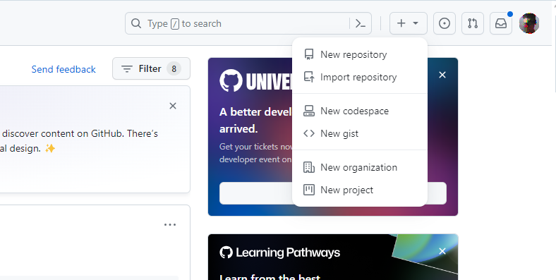
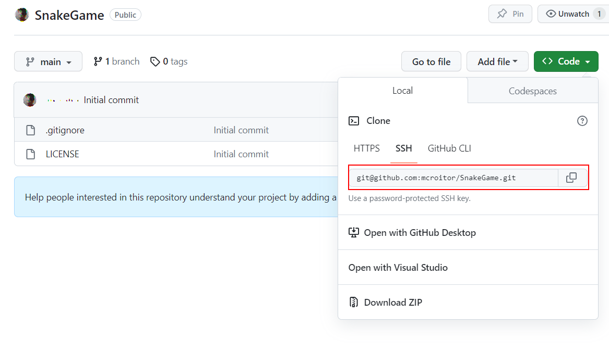

# Создание проекта. Работа с GIT.

## Цель

Выполнив данную работу студент научится работать с системой контроля кода GIT, а также получит базовые знания по организации проектов.

## Задание

Задание выполняется на основе предыдущей лабораторной работы. С целью упрощения работы предлагается выполнять шаги в среде разработки [`Visual Studio Code`](https://code.visualstudio.com/Download), и установленным с операционной среде компилятором [`MingW G++`](https://msys2.org). Также на компьютере должен быть установлен [`GIT`](https://git-scm.com/downloads).

### 1. Регистрация на [GitHub](https://github.com/)

### 2. Создание проекта

После аутентификации на GitHub, в правом верхнем углу есть иконка `+`. Пр нажатии на неё можно создать новый репозиторий.



Создайте новый, пустой репозиторий и назовите его `SnakeGame`.

### 3. Копирование репозитория на локальный компьютер

Создайте копию репозитория, который был вами создан. Для этого скопируйте ссылку на репозиторий.



Откройте командную строку, перейдите в папку, в которой хотите держать проект, и выполните команду:

```bash
git clone <copied url>
```

Создайте новую ветку для выполнения работы.

```bash
# create a new branch and switch to
git checkout -B lab01
```

### 4. Создание структуры файлов

В получившейся папке `SnakeGame` создайте следующие файлы:

- `point.hpp`:

```cpp
#pragma once

struct Point{
   int x;
   int y;
};
```

- `apple.hpp`

```cpp
#pragma once

#include "point.hpp"

class Apple {
   Point _position;
public:
   Apple();
   Apple(const Point& position);
   Point GetPosition() const;
};
```

- `direction.hpp`

```cpp
#pragma once

enum class Direction {
   Top, Left, Right, Bottom
};
```

- `snake.hpp`
  
```cpp
#pragma once

#include "apple.hpp"
#include "direction.hpp"
#include "point.hpp"

class Snake {
   Point _segments[100];
   int _nr_segments;
public:
   Snake();
   Snake(const Point& _position);
   void Move(Direction direction);
   int GetSize() const;
   Point GetPosition() const;
   void Eat(const Apple& apple);
};
```

- `board.hpp`

```cpp
#pragma once

class Board {
   int _width;
   int _height;
public:
   Board(int width = 20, int height = 20);
   int GetWidth() const;
   int GetHeight() const;
};
```

- `game_engine.hpp`

```cpp
#pragma once
#include "apple.hpp"
#include "snake.hpp"
#include "board.hpp"

class GameEngine {
   Apple _apple;
   Snake _snake;
   Board _board;
public:
   GameEngine();
   void Init();
   void Run();
};
```

- `painter.hpp`

```cpp
#pragma once

#include "point.hpp"

class Painter {
public:
   void DrawImage(Point topLeft, Point bottomRight, char** image);
   void WriteText(Point position, char* text);
};
```

### 5. Добавление описания проекта

Создайте в папке `SnakeGame` файл `readme.md` со следующим описанием:

1. название проекта
2. что представляет из себя проект
3. каковы правила игры Змейка
4. перечислите все объявленные новые типы данных, дайте им краткое пояснение (что представляют объекты данного типа).

### 6. Публикация кода на GitHub


В папке репозитория выполните следующие команды из командной строки:

```bash
# add all files to tracking
git add *
# check status
git status
# create a commit
git commit -m "structure defined"
# push commit to remote repository
git push
```

После этого вы можете добавить созданную ветку `lab01` к ветке `main` при помощи запроса на слияние (pull request).

## Представление

Для представления результата прикрепите ссылку на репозиторий в GitHub к заданию на Moodle.

## Оценивание

- `1 балл` - создание аккаунта на GitHub
- `1 балл` - создание проекта
- `4 балла` - создание файлов `hpp` с необходимыми структурами
- `3 балла` - создание описания проекта в файле `README.md`
- `1 балл` - публикация кода на GitHub в ветку `lab01`
- `-1 балл` - за каждый день просрочки сдачи
- `-5 баллов` - за копирование кода у других студентов
